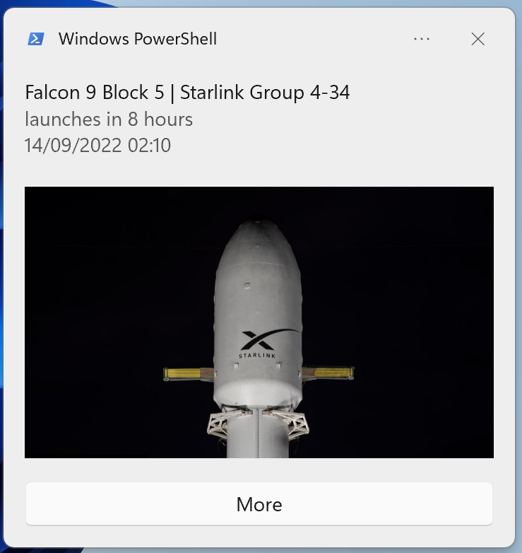

# Rocket Launch Notifications

### Features

- Upcoming Launch Notifications 1 Day and 1 Hour before launch and when the launch outcome is confirmed
- Picture of the rocket directly embedded in the notification
- "More" button that redirects to the corresponding SpacelaunchNow Website for more information like real time countdown, launchsite and mission details


  

### Technical Details

- Data provided by [The Space Devs](https://thespacedevs.com/)
- Every 60 Seconds the program checks for new notifications to be send (Note: The Request is send to my own backend server that caches the upcoming launches from the api from The Space Devs)
- If a notification is send it will be stored in the notifications.json file to keep track of already send notifications and the NET launch time the notification was send for, example:

```json5
{
    "map": {
        "b7a9d0e7-776f-4140-ad20-7565993731c9":
        {
            "timestamp": "2022-09-07T21:45:00Z",
            "one_day": true,
            "one_hour": true,
            "now": false
        }
    }
}
```

- Due to windows notification limitation the image has to be downloaded before it can be displayed in a notificatio
- To keep track of downloaded images their path will be stored in the images.json file

```json5
{
    "map": {
        "Yf2hr-CR3C4ZsfeGGIidE": "C:\\example_path\\GitHub\\rocket_reminder\\Yf2hr-CR3C4ZsfeGGIidE.png"
    }
}
```

- To avoid images getting lost and wasting storage, for example when rebooting exactly when a notification is send, at the startup of the program every image thats still in the images.json file will be deleted

### Todo

  - [ ] Support Linux
  - [ ] Support MacOS
  - [ ] Add link to livestream button if available
  - [ ] Create installer with autostart
  - [ ] Add support for event notifications
  - [ ] Add task to system tray for settings